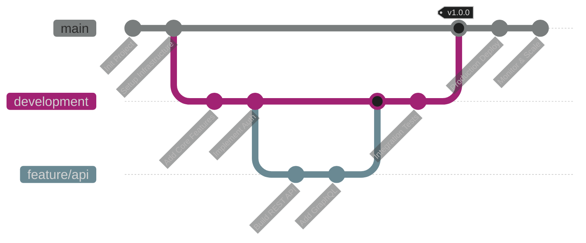

<div align="center">


**`Build • Innovate • Scale`**

<p>
  
  
  
</p>

[](https://bhinneka.tech)
[](mailto:info@bhinneka.tech)
[](#)

</div>

---

## 🛠️ `$ cat tech_stack.yml`

<div align="center">

### Backend Arsenal

<p>
  
</p>

### Frontend Weapons

<p>
  
</p>

### Database & Cache

<p>
  
</p>

### DevOps & Tools

<p>
  
</p>

### Infrastructure

<p>
  
</p>

</div>

```yaml
stack:
  backend:
    - Laravel      # PHP powerhouse
    - Node.js      # JavaScript runtime
    - FastAPI      # Python speed
  
  frontend:
    - React        # UI library
    - Next.js      # React framework
    - TailwindCSS  # Utility-first CSS
  
  database:
    - PostgreSQL   # Production DB
    - MySQL        # Relational DB
    - Redis        # In-memory cache
  
  devops:
    - Docker       # Containerization
    - GitHub Actions # CI/CD
    - Nginx        # Web server
```

---

## 💡 `$ ls -la projects/`

<table>
<tr>
<td width="50%">

<div align="center">

### 🎓 **EduPlatform**

```bash
📦 Learning Management System
├── 📚 Course Management
├── 👥 Student Portal
├── 📊 Analytics Dashboard
└── 🎯 Interactive Quizzes
```


**[`View Code →`](https://github.com/bhinetech/edu-platform)**

</div>

</td>
<td width="50%">

<div align="center">

### 🛒 **CommerceHub**

```bash
📦 E-Commerce Platform
├── 🛍️ Product Catalog
├── 💳 Payment Gateway
├── 📦 Order Management
└── 📱 Mobile Responsive
```


**[`View Code →`](https://github.com/bhinetech/commerce-hub)**

</div>

</td>
</tr>

<tr>
<td width="50%">

<div align="center">

### 📊 **DataFlow**

```bash
📦 Analytics Platform
├── 📈 Real-time Charts
├── 🔍 Data Visualization
├── 📊 Custom Reports
└── 🔔 Alert System
```


**[`View Code →`](https://github.com/bhinetech/dataflow)**

</div>

</td>
<td width="50%">

<div align="center">

### ⚙️ **AutoFlow**

```bash
📦 Workflow Automation
├── 🔄 Task Scheduler
├── 🤖 Bot Integration
├── 📧 Email Automation
└── 🔗 API Connector
```


**[`View Code →`](https://github.com/bhinetech/autoflow)**

</div>

</td>
</tr>
</table>

<div align="center">

**[`📂 View All Repositories →`](https://github.com/orgs/bhinetech/repositories)**

</div>

---

## 🔥 `$ git log --all --graph --oneline`

<div align="center">




| 🚀 Innovation | 🤝 Collaboration | 📈 Scalability | ✨ Quality |
|:-------------:|:----------------:|:--------------:|:----------:|
| Modern solutions with cutting-edge tech | Team-first mindset, open communication | Systems ready to handle growth | Clean code, solid architecture |
| Continuous learning & improvement | Knowledge sharing culture | Performance-focused design | Rigorous testing & reviews |
| Embrace new technologies | Cross-functional teamwork | Cloud-native architecture | Production-ready standards |

---

## 🤝 `$ git contribute`

```bash
# We welcome contributors! Here's how to get started:

# 1. Fork the repository
git clone https://github.com/bhinetech/project-name.git

# 2. Create your feature branch
git checkout -b feature/amazing-feature

# 3. Commit your changes
git commit -m 'feat: add amazing feature'

# 4. Push to the branch
git push origin feature/amazing-feature

# 5. Open a Pull Request
# 🎉 You're awesome!
```

<div align="center">

### 📋 Contribution Guidelines

| 🐛 **Bug Reports** | 💡 **Feature Requests** | 🔧 **Pull Requests** | 📖 **Documentation** |
|:------------------:|:----------------------:|:--------------------:|:--------------------:|
| Found a bug? Let us know! | Have an idea? Share it! | Code ready? Send it over! | Help improve our docs! |

**[Read Full Guidelines →](CONTRIBUTING.md)**

</div>

---

## 📄 `$ cat LICENSE`

<div align="center">

```bash
MIT License | Copyright (c) 2024 Bhinetech
Permission is hereby granted, free of charge, to any person obtaining a copy...
```

**[View Full License →](LICENSE)**

</div>

---

<div align="center">


```ascii
  ____        _ _     _ _               _   _            __       _                  
 | __ ) _   _(_) | __| (_)_ __   __ _  | |_| |__   ___  / _|_   _| |_ _   _ _ __ ___ 
 |  _ \| | | | | |/ _` | | '_ \ / _` | | __| '_ \ / _ \| |_| | | | __| | | | '__/ _ \
 | |_) | |_| | | | (_| | | | | | (_| | | |_| | | |  __/|  _| |_| | |_| |_| | | |  __/
 |____/ \__,_|_|_|\__,_|_|_| |_|\__, |  \__|_| |_|\___|_|  \__,_|\__|\__,_|_|  \___|
                                |___/                                                 
```

**Building technology for a better digital ecosystem** 🌍


</div>
